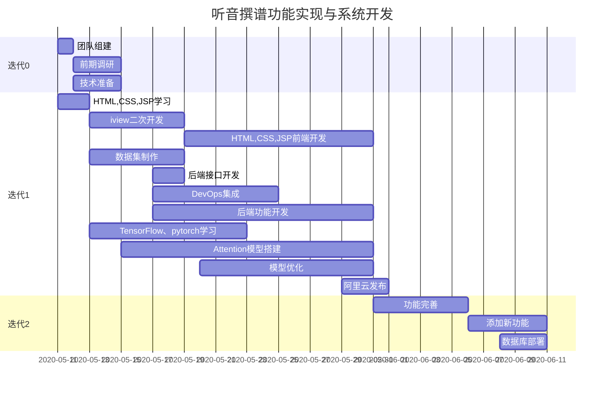
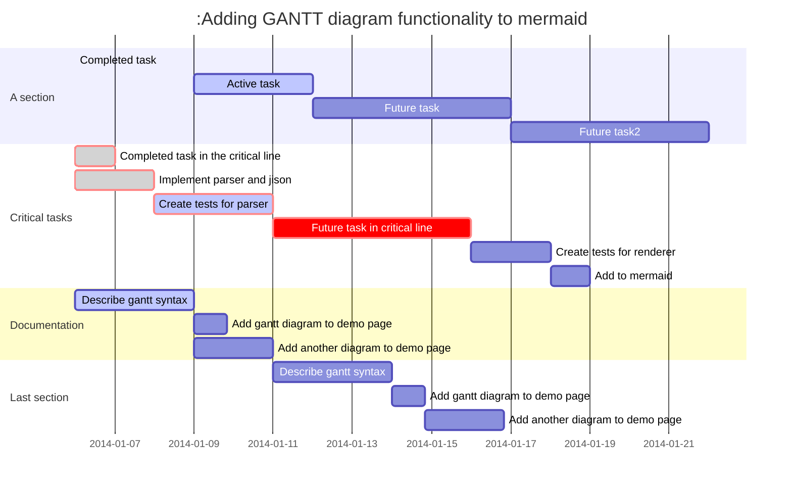
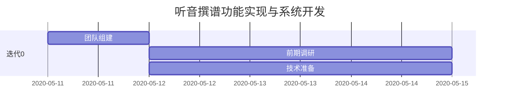
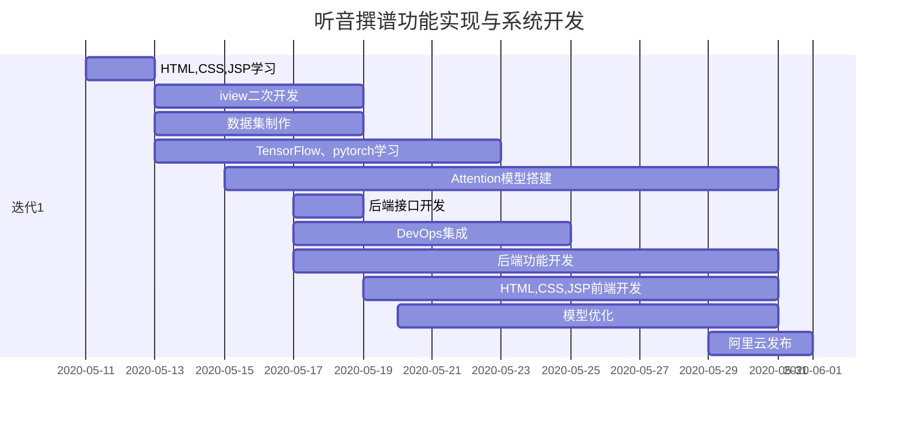
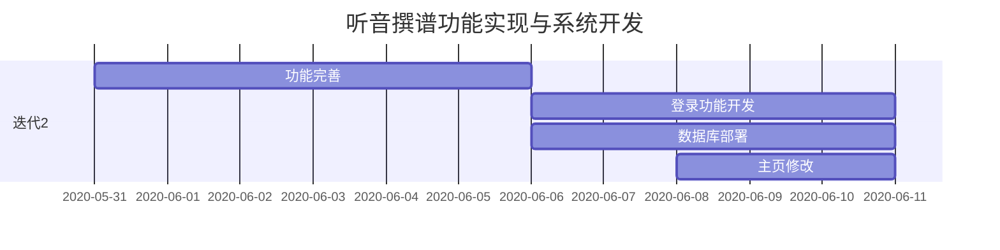
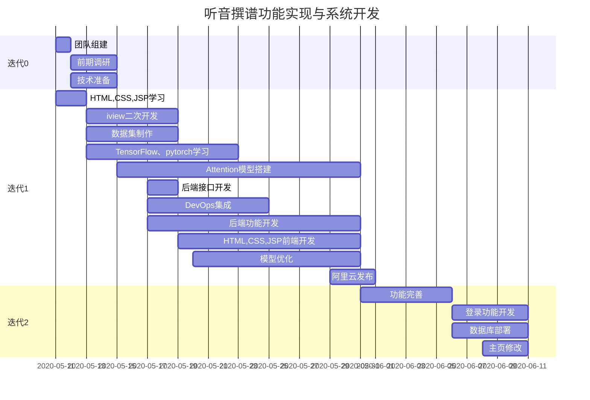

```mermaid
gantt
        dateFormat  YYYY-MM-DD
        title 听音撰谱功能实现与系统开发
        section 迭代0
        团队组建            :   des1, 2020-05-11,1d
        前期调研               :  des2, after des1, 3d
        技术准备               :  des3, after des1, 3d
        
        section 迭代1
        HTML,CSS,JSP学习        : 2020-05-11,2020-05-13
        iview二次开发          :   2020-05-13, 2020-05-19
        HTML,CSS,JSP前端开发        :  2020-05-19,2020-05-31
        
        数据集制作   : 2020-05-13,2020-05-19
        后端接口开发   : 2020-05-17,2020-05-19
        DevOps集成        :  2020-05-17,8d
        后端功能开发        :  2020-05-17,2020-05-31
        
        TensorFlow、pytorch学习          :  2020-05-13, 10d
        Attention模型搭建   :   2020-05-15, 16d
        模型优化   :   2020-05-20, 11d
        
        阿里云发布   :   2020-05-29, 3d
        
        section 迭代2
        功能完善				: 2020-05-31, 6d
        添加新功能           :2020-06-06, 2020-06-11
        数据库部署           :2020-06-08, 2020-06-11
```

```mermaid
gantt


       dateFormat                :YYYY-MM-DD
       title                     :Adding GANTT diagram functionality to mermaid
       excludes                  :excludes the named dates/days from being included in a charted task.. 
       section A section
       Completed task            :done,    des1, 2014-01-06,2014-01-08
       Active task               :active,  des2, 2014-01-09, 3d
       Future task               :         des3, after des2, 5d
       Future task2              :         des4, after des3, 5d

       section Critical tasks
       Completed task in the critical line :crit, done, 2014-01-06,24h
       Implement parser and jison          :crit, done, after des1, 2d
       Create tests for parser             :crit, active, 3d
       Future task in critical line        :crit, 5d
       Create tests for renderer           :2d
       Add to mermaid                      :1d

       section Documentation
       Describe gantt syntax               :active, a1, after des1, 3d
       Add gantt diagram to demo page      :after a1  , 20h
       Add another diagram to demo page    :doc1, after a1  , 48h

       section Last section
       Describe gantt syntax               :after doc1, 3d
       Add gantt diagram to demo page      :20h
       Add another diagram to demo page    :48h
```

```mermaid
gantt
        dateFormat  YYYY-MM-DD
        title 听音撰谱功能实现与系统开发
        section 迭代0
        团队组建            :   des1, 2020-05-11,1d
        前期调研               :  des2, after des1, 3d
        技术准备               :  des3, after des1, 3d
        
      
```

```mermaid
gantt
        dateFormat  YYYY-MM-DD
        title 听音撰谱功能实现与系统开发

        
        section 迭代1
        HTML,CSS,JSP学习        : 2020-05-11,2020-05-13
   
        iview二次开发          :   2020-05-13, 2020-05-19
       
        
        数据集制作   : 2020-05-13,2020-05-19
        TensorFlow、pytorch学习          :  2020-05-13, 10d
        Attention模型搭建   :   2020-05-15, 16d
        
        后端接口开发   : 2020-05-17,2020-05-19
        DevOps集成        :  2020-05-17,8d
        后端功能开发        :  2020-05-17,2020-05-31
         HTML,CSS,JSP前端开发        :  2020-05-19,2020-05-31
        
        
        
        模型优化   :   2020-05-20, 11d
        
        阿里云发布   :   2020-05-29, 3d
        
```

```mermaid
gantt
        dateFormat  YYYY-MM-DD
        title 听音撰谱功能实现与系统开发
      
        
        section 迭代2
        功能完善				: 2020-05-31, 6d
        登录功能开发           :2020-06-06, 2020-06-11
        数据库部署           :2020-06-06, 2020-06-11
        主页修改           	:2020-06-08, 2020-06-11
```

```mermaid

gantt
        dateFormat  YYYY-MM-DD
        title 听音撰谱功能实现与系统开发
        section 迭代0
        团队组建            :   des1, 2020-05-11,1d
        前期调研               :  des2, after des1, 3d
        技术准备               :  des3, after des1, 3d
        
        section 迭代1
        HTML,CSS,JSP学习        : 2020-05-11,2020-05-13
   
        iview二次开发          :   2020-05-13, 2020-05-19
       
        
        数据集制作   : 2020-05-13,2020-05-19
        TensorFlow、pytorch学习          :  2020-05-13, 10d
        Attention模型搭建   :   2020-05-15, 16d
        
        后端接口开发   : 2020-05-17,2020-05-19
        DevOps集成        :  2020-05-17,8d
        后端功能开发        :  2020-05-17,2020-05-31
         HTML,CSS,JSP前端开发        :  2020-05-19,2020-05-31
        
        
        
        模型优化   :   2020-05-20, 11d
        
        阿里云发布   :   2020-05-29, 3d
        
        section 迭代2
        功能完善				: 2020-05-31, 6d
        登录功能开发           :2020-06-06, 2020-06-11
        数据库部署           :2020-06-06, 2020-06-11
        主页修改           	:2020-06-08, 2020-06-11
        
      
```

