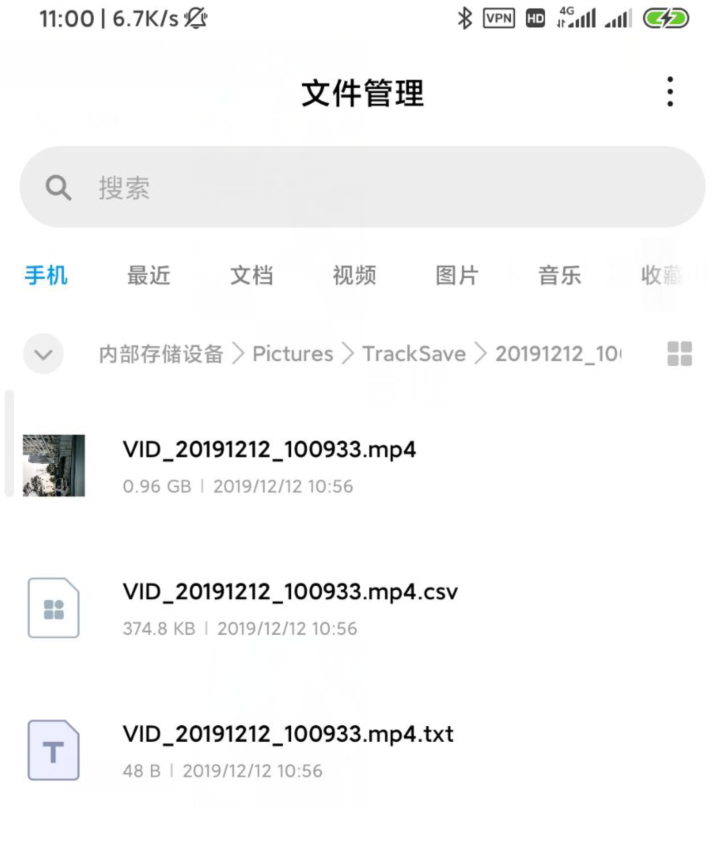
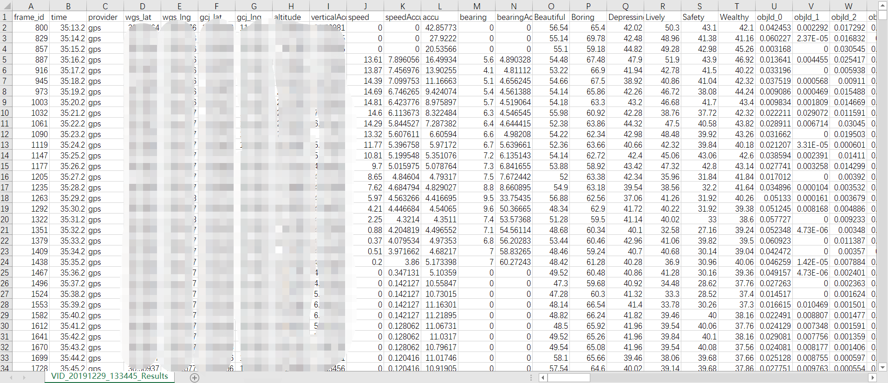
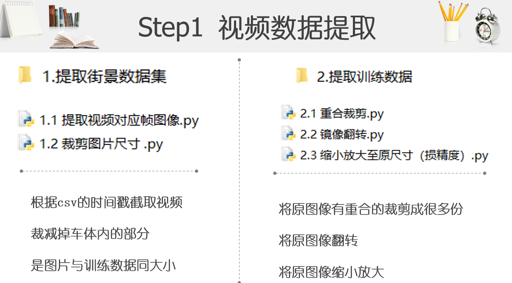
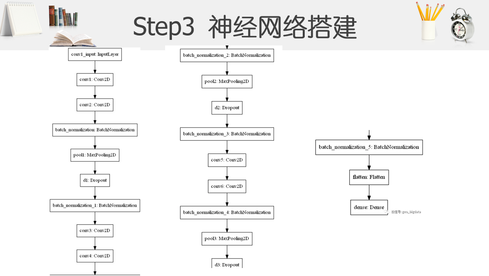
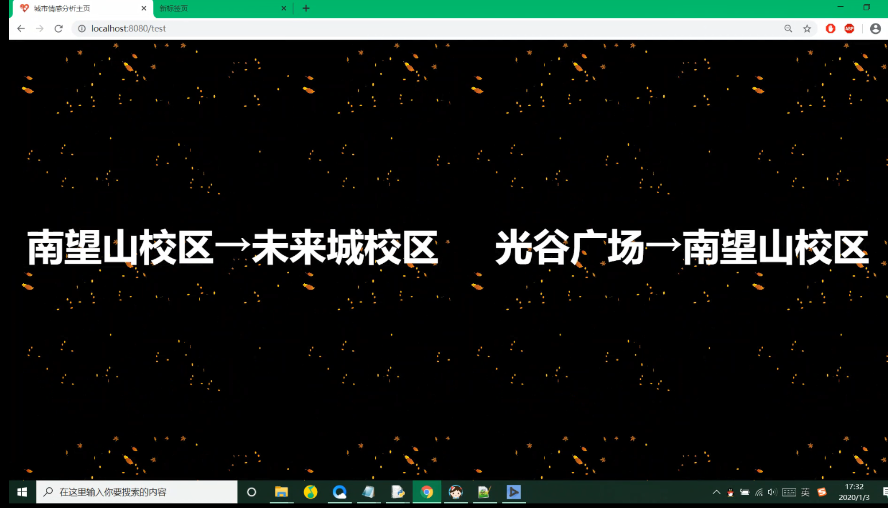
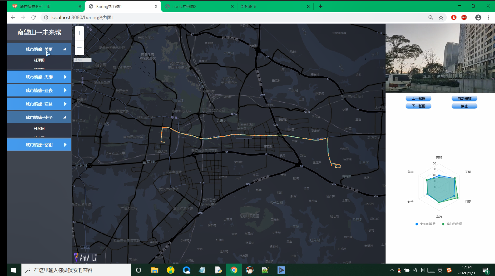
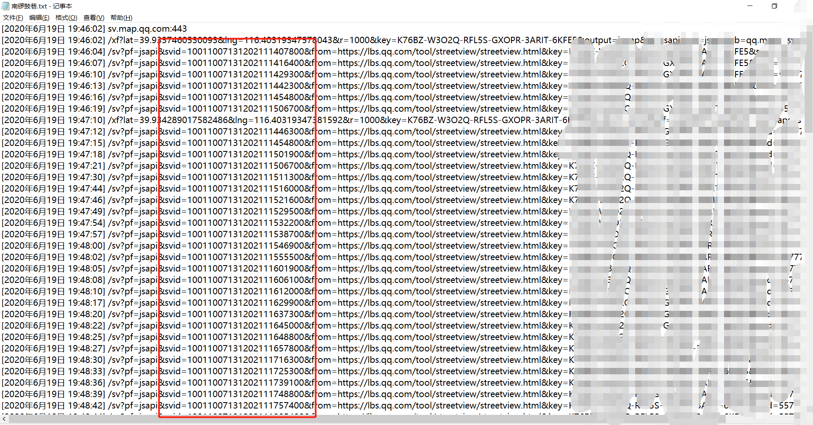
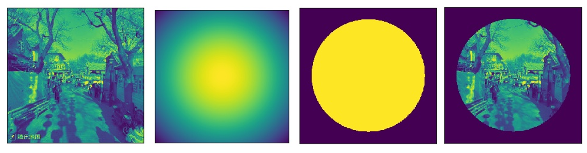
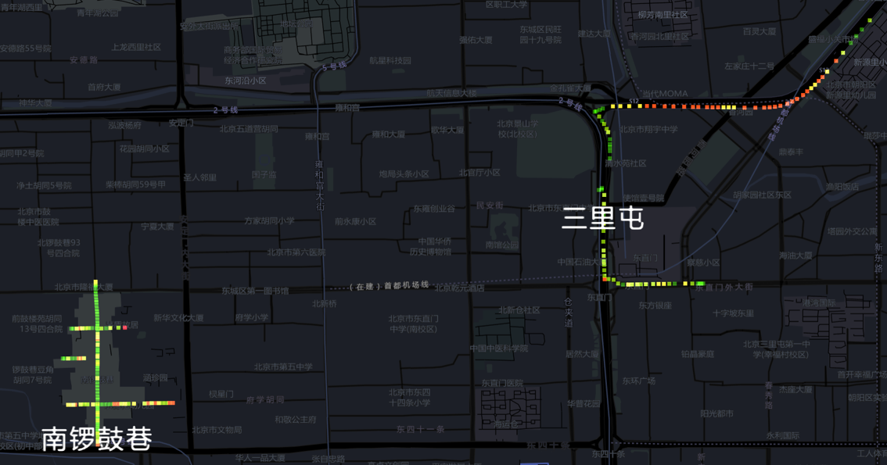

# :world_map: Geographical Information System & Big Data

地理信息系统和大数据都是同一个老师教的，因此我归类在一起了。在这位老师的课上我学会了很多数据处理的知识，他的实习常常是从数据获取，到处理，到可视化整个流程都要走一遍。我也因此收获良多，也很感谢这位老师。

当然啦，我的所有老师都给我提供了很多帮助！所有老师我都很感激！真诚:bow:

As Geographical Information System and Big Data was taught by the same teacher, so I put them in one folder. I have learned many knowledge about data processing in his class, and his objects always could train our abilities from data collection, data processing and data visualization. So I appreciate this teacher since learn a lot from him.

Of Course! All My Teachers Have Give me Many Both Academic Help And Life Experiences! I Appreciate ALL OF MY TEACHERS Sincerely :bow:!   

接下来我会展示两个项目，一个是城市情感打分，一个是绿视率分析。

I will show two projects below, one is *Urban Perception Assessment*, the other is "Green Looking Ratio Calculating"

## :cityscape: Urban Perception Assessment

第一个实验是我们参考姚老师的《A human machine adversarial scoring framework for urban perception assessment using street view images》进行的实验。相比原来实验中的语义分割神经网络，本实验中我们采用卷积神经网络的方式来进行街景打分。

 The first item is a paper from Dr Yao about **urban perception assessment using street-view images**,instead of the RCN in the initial paper,  we used CNN to give score for street-view images.

###  :camera:Data Collection

在街景采集部分，我制作了一个安卓手机APP，用来上街录制视频，采集街景。录制视频的同时还会调用GPS传感器，将经纬度坐标和时间戳记录在csv文件中，方便从视频中提取图片，并为可视化做准备。

In this part, I made a Android app to collection street view from the lane. The app would also use mobile phone's GPS to save Latitude and longitude into a csv file with timestamp. So we could easily slice images from the video, and the location could also used as a prepare for the visualization.

The UI of App

Files Saving

CSV File with Loaction

### :factory:Data Processing

#### Step 1 Extract Street View

我们使用python进行街景提取。由于视频中存在部分被车内遮挡的部分，因此还进行了裁剪。为了扩大训练集，我们还用翻转和缩小放大的方式来处理图片，让训练出的神经网络模型更加鲁棒。

We used python to get street views from the video. As there were some internal parts of cars in the images, so we should cut them off. To enlarge the training set, we also useed mirror flipping and inclining resolution to process the data, in order to make the model more robust.

### Step 2 Training set Construction

我们将图片由RGBA变成了RGB三通道，并用pickle保存全部图片数据。图片有1390张，长x宽为300x400。

We converted the image from RGBA to RGB, so it changed into 3 channels. And then we use pickle to save all the data. We have 1390 pics, and all of them have same height and weight as 300x400. 

### Step 3 Neural Network (CNN)

参照网上的博客，我们构建了三层卷积神经网络。用了很多3x3的卷积核来提取特征，以及用2x2的池化层减小维度。

According the blogs from the Internet, we built a 3 layers convolution neutral network. We used a lot of convolution kernel to extract features and some 2x2 pooling layers to decrease the shape.

## :rainbow:Data Visualization

最后是数据可视化部分，这里我们使用了蚂蚁金服的可视化框架[Antv](https://antv.vision/)来进行地图可视化。使用python的web.py包制作服务器，并将服务发布上去。

Finally was the data visualization, we used a visualization frame called [Antv](https://antv.vision/), developed by ANT FINANCIAL SERVICES GROUP. Web.py is a web package in python, we chose it to develop our service.

Home Page

Bar Chart

Heat Map

The Loss Line chart

## :evergreen_tree: Green Looking Ratio Calculating

绿视率计算是大数据课程的一个作业，我在参考了诸多论文后，了解了绿视率计算的方法。本次实验中我还在GitHub上找到了[开源的FCN代码](https://github.com/lsh1994/keras-segmentation)，使用的训练数据集是[CamVid](https://github.com/alexgkendall/SegNet-Tutorial/tree/master/CamVid)。

Green Looking Ratio Calculating is a final project in Big Data Course. I have read many papers to understand how to calculate Green Looking Ratio and what can we do through this result. In addition, I used the open source code of [FCN](https://github.com/lsh1994/keras-segmentation) in GitHub, and the training set I choosing was  [CamVid](https://github.com/alexgkendall/SegNet-Tutorial/tree/master/CamVid).

Technical Routes

###  :snail:Data Collection

这里我用的是[Fiddler](https://www.telerik.com/fiddler)工具进行的数据爬取。在Fiddler中设置指定网址的主机名，通过手动点击街景地图的方式，获取街景的id信息。然后使用[腾讯开发者平台](https://lbs.qq.com/panostatic_v1/index.html)的位置服务的API，来获取该地的街景。

In this project I used [Fiddler](https://www.telerik.com/fiddler) to collect the street view images. After setting a filter which will select message from appointed host name, you can just click the street view map to get the id of pictures. The [Tencent Developer Platform](https://lbs.qq.com/panostatic_v1/index.html) could offer service of *Static Street View API*, you can just apply for a key to use it.

Crawling Images

Saved Message

### :factory:Data Processing

#### Step 1 Significant Feature Extraction

[《基于腾讯街景的长三角主要城市林荫道景观视觉评价》](http://cdmd.cnki.com.cn/Article/CDMD-10270-1019099544.htm)中提到了一种观点显著区域的观点，并用 [Exploiting Surroundedness for Saliency Detection: A Boolean Map Approach](https://ieeexplore.ieee.org/document/7226835#:~:text=Exploiting%20Surroundedness%20for%20Saliency%20Detection%253A%20A%20Boolean%20Map,proposing%20a%20Boolean%20Map%20based%20Saliency%20model%20(BMS).)内的公式进行显著区域计算。计算的公式和结果如下所示。其中$x$是图像中每个点的坐标位置，$c$表示的是图像中心点的坐标位置，$\sigma$是一个输入参数。
$$
S_p=exp(- \frac{||x-c||)^2}{\sigma^2})
$$

In paper [《基于腾讯街景的长三角主要城市林荫道景观视觉评价》](http://cdmd.cnki.com.cn/Article/CDMD-10270-1019099544.htm) I found a view about the Significant Feature，the calculating function came from  [Exploiting Surroundedness for Saliency Detection: A Boolean Map Approach](https://ieeexplore.ieee.org/document/7226835#:~:text=Exploiting%20Surroundedness%20for%20Saliency%20Detection%253A%20A%20Boolean%20Map,proposing%20a%20Boolean%20Map%20based%20Saliency%20model%20(BMS).) . The formula and the results are just as the below. $x$ is the position of each pixels, ，$c$is the centre point of the image，$\sigma$ is a parameter set by us.

#### Step 2 Neural Network

U-Net是现在常见的语义分割神经网络之一，训练数据集来自于CamVid，训练结果如下。

U-Net is one of the most common FCN algorithm. As the training set come from CamVid, the result is just like below.

### Step 3 Calculate Green Looking Ratio

由于在绿视率理论刚提出的时候，仍没有精确分类街景的算法出现，因此计算出的面积等信息较为模糊。现在用了神经网络能够更加精准地进行语义分割，因此我对公式进行了改进。原来的公式是(1)，我给改成了(2)。原来的作者[青木��二](https://researchmap.jp/read0003752)计算的是街道的长度和建筑的高度求得近似面积，绿植面积也是近似出来的。现在所有的面积都可以更加的精确求出，因此使用 绿植精确面积/(街道面积 +建筑面积)。理论上来讲会更加精确，不过由于缺少对比实验，有待商榷。

As there was no accurate algorithm to segment the objects of images,  the old formula is not fitting now. With the more precise FCN, I changed the equation from (1) to (2). In the initial, the author,[Yoji Aoki](https://researchmap.jp/read0003752),  used the multiplication of length of the streets and the average height of buildings. Now with the more accuracy FCN algorithm, I use the exact area of street and buildings to make plus, and of course the green plants area come from the significant feature. It **should** be better then the  past function, but to be honest, the new one haven't be compared with the old one. So it still need experiments to confirm.
$$
GLR_{old} = \frac{Green \ Area(S)}{(Street\ Length(L)*Average\ Building\ Height(H) )}*100\%       \tag{1}
$$

$$
GLR_{new} = \frac{S_p\ Green \ Area(S_{plant})}{(Street\ Area(S_{building})+Building\ Area(S_{street}) )}*100\%       \tag{2}
$$

## :rainbow:Data Visualization

