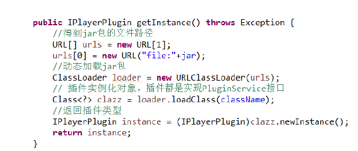
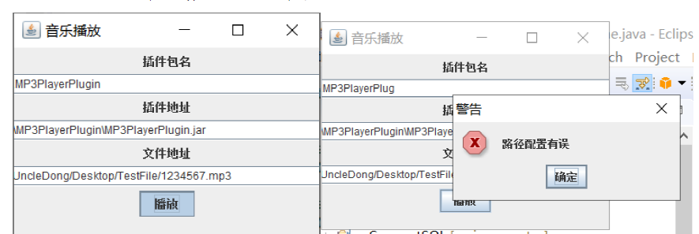

# :notes:Plug of Music Player

一个通过jar包实现的简单接口功能，功能是切换mp3, mid等音频文件的播放 ，jar包中的函数名相同，因此每次直接调用就可以。

A simple plug of music playerin order to change type of music file like mp3 or mid easyly. Beacuse all jars have same function name, so what we should do to change function is only to change the jar.

## 成果展示(The Accomplishment)

Declare the Interface of Plug

Using jar to play the music

Load plug Dynamically

Error when select wrong path

## 参考(Reference)

[1]Java 接口开发 接口开发 接口开发 https://blog.csdn.net/u010675669/article/details/86677540