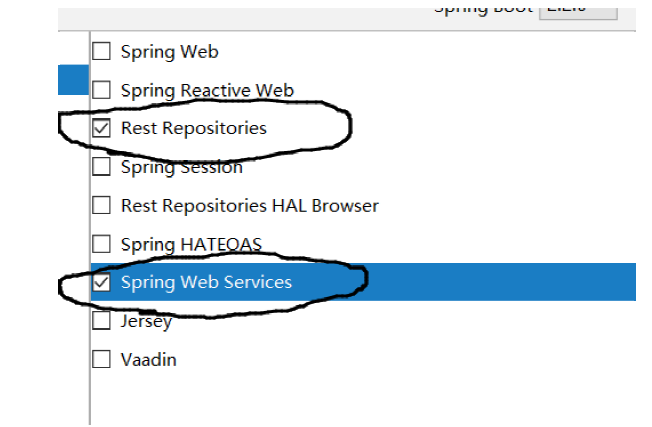
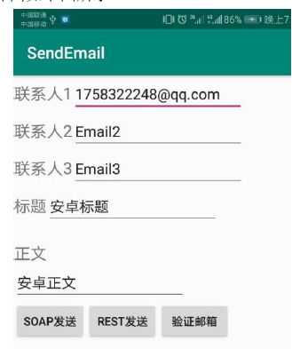
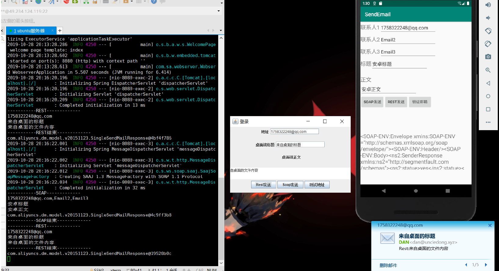

# :ocean:REST&SOAP

使用Spring Boot架构，实现一个能够发送电子邮件消息的Web Service服务，要求提供基于SOAP协议和REST风格的两种接口。

Develop a Web Service by Spring Boot, you need to use both SOAP and REST to desin the interface.

本次实习中，我开发了PC和Android两个部分的客户端，用来向我的QQ邮箱发送消息。

In this project, I developed client both on PC and Android to send messages to my QQ Email.

## 成果展示(The Accomplishment)

Choose REST and SOAP in IDEA

Install dependence by maven

Cilent on PC

Cilent on Android

Final Result

## 参考(Reference)

[1] 阿里云邮件服务官方文档：https://help.aliyun.com/document_detail/29459.html
[2] 域名解析和邮件发送：https://blog.janking.cn/post/aliyun-email.html
[3] REST风格教程 https://www.cnblogs.com/wmyskxz/p/9010832.html
[4] Soap风格教程 https://blog.csdn.net/panchang199266/article/details/83116941
[5] ubuntu搭建java环境：https://blog.csdn.net/smile_from_2015/article/details/80056297
[6] IDEA国内镜像：https://www.cnblogs.com/phpdragon/p/7216626.html
[7] StackOverFlow问题回答：https://stackoverflow.com/questions/9413625/android-android-os-networkonmainthreadexception
[7]安卓内网络访问：https://developer.android.com/reference/android/os/AsyncTask.html