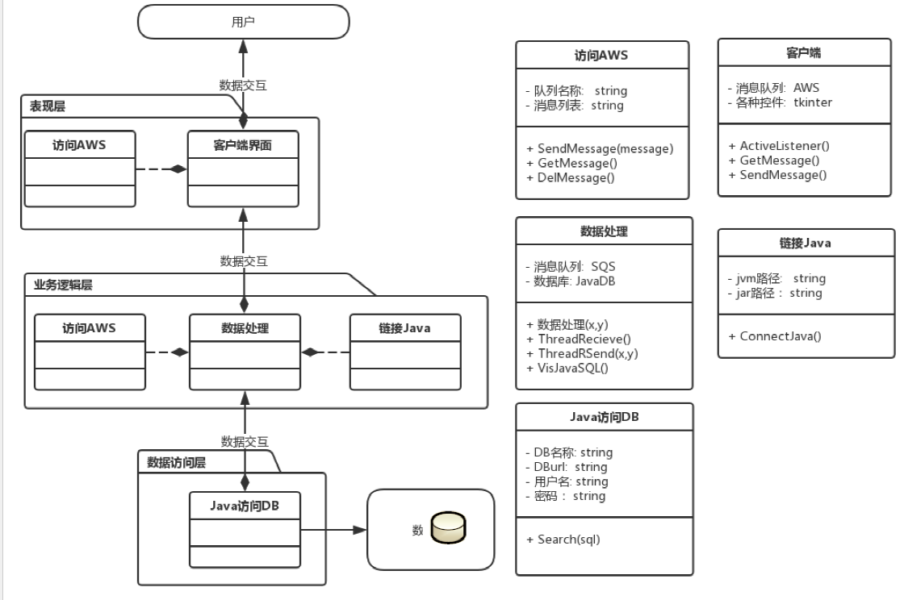
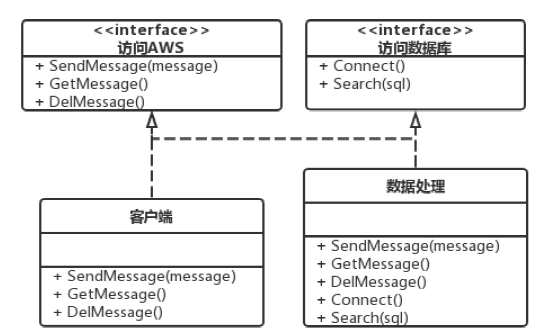
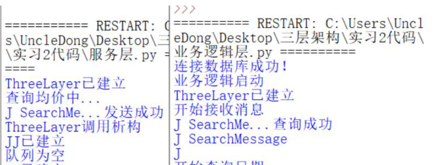
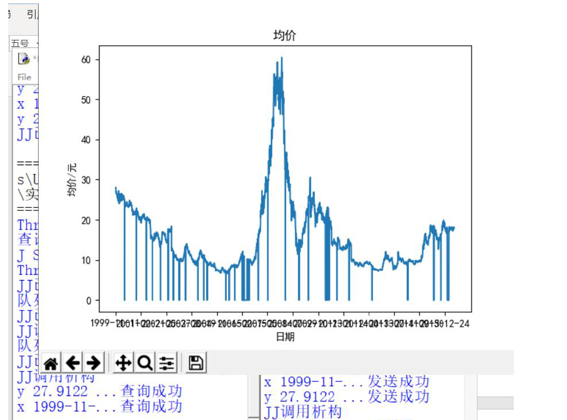
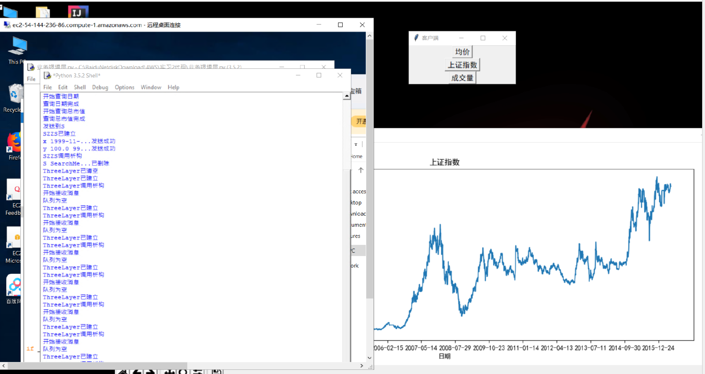

# :atm:Three-Tier Architecture

将整个业务划分为“表现层”，“业务逻辑层”，“数据访问层”，以体现**高内聚低耦合**的思想。

Dividing the business into "Client Tire", "Business Logic Tier" and "Database Tier", in order to realize the idea of **Low Coupling, High Cohesion**

本次实习中，我在本地计算机搭建表现层，EC2远程服务器搭建业务逻辑层，AWS远程数据库搭建数据访问层。采用混合编程的思想，使用jdbc连接数据库，在EC2部署python程序调用jar包访问数据库，并通过SQS消息队列返回到本地计算机。

In this project, Client Tire was set in my local laptop, Business Logic Tier was set in EC2, Database Tier was set in the AWS's MySQL database. Mixturing Python and Java, I used jdbc to connect DB, and parcel it into a jar which will be used by python in EC2 to exchange the data. Finally, all the result from  Business Logic Tier will be transmit to laptop by SQS.

## 成果展示(The Accomplishment)

Architecture Design 

Interface Design

Interfaces Encapsulating by Python (Database Tier)

Test for Connect Through SQS (Business Logic Tier)

Localhost Result (Client Tire)

Three Tire

## 参考(Reference)

- https://boto3.amazonaws.com/v1/documentation/api/latest/guide/quickstart.html
- https://docs.aws.amazon.com/sqs/index.html#lang/zh_cn
- https://docs.aws.amazon.com/sns/index.html#lang/zh_cn4
- https://blog.csdn.net/weixin_39407066/article/details/83625316
- https://www.cnblogs.com/ai594ai/p/8615818.html

